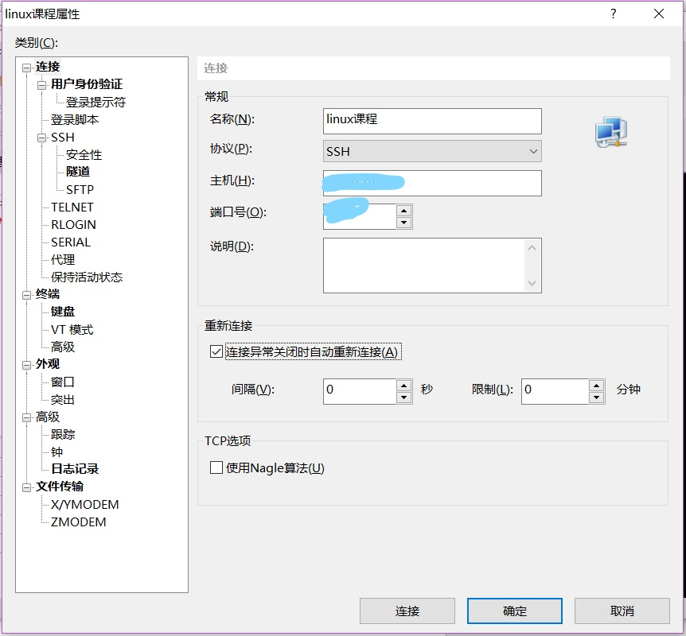
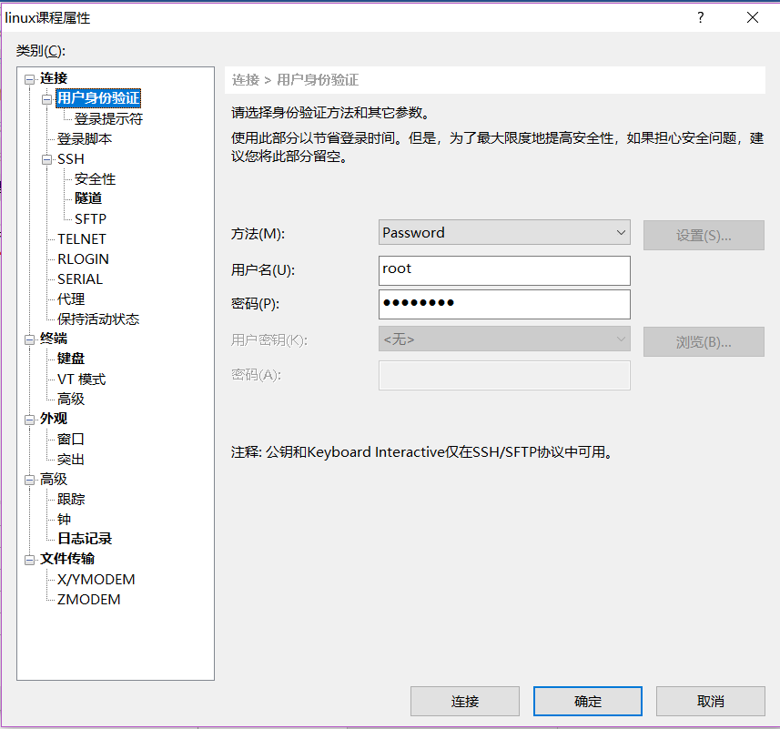
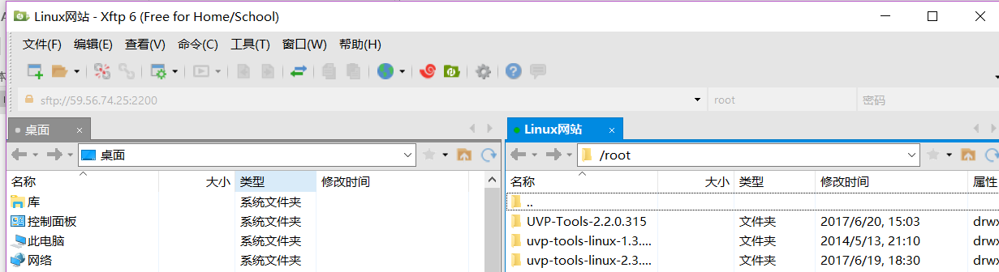

# Xshell使用说明
---

**Content**

- [下载](#下载)
- [连接](#连接)
- [传输文件](#传输文件)

---

## **下载**

- 官网下载，选择家庭/个人，填写邮件地址就可以使用免费的个人版。这里要把Xshell和Xftp都下载下来。Xshell用来连接服务器进行操作，Xftp用来本地和服务器之间传输文件。

## **连接**

- 新建会话；
- 点击 "连接"；
- 名称用来标识这个服务器；
- 协议选择对应的协议；
- 主机填写服务器的ip地址；
- 端口号，ssh协议默认端口是22，如果有修改就改成修改后的内容。

- 配置用户名和密码：
- 点击 "用户验证方式"
- 选择验证方式；
- 用户名填写用户；
- 密码填写密码；
- 这样连接后就会自动进入root模式。

- 连接成功后，终端中会显示所连接的系统的终端界面(如Linux的root终端)。

## **传输文件**

- 打开Xftp，点击 "新建文件传输；
- 第一次连接某服务器，要添加会话信息，配置方法类似xshell中连接服务器；
- 弹出如下窗口：左边是本机的目录，右边是服务器中的目录。将需要传输的文件互相拖拽即可。

