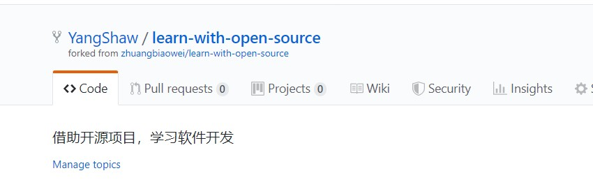
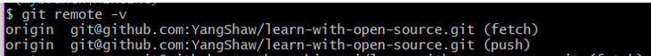
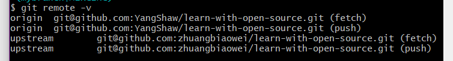

# Git学习笔记

---
**Content**
- [10.25 提交PR过程中遇到的问题和解决方法](#1025-提交PR过程中遇到的问题和解决方法)

- [10.21 Fork&PR](#1021-forkpr)
- [9.20 Git基本指令](#920-git基本指令)
- [参考资料](#参考资料)

---

## **10.25 提交PR过程中遇到的问题和解决方法**

- 保持与项目同步：在进行修改和PR之前，要先确保自己的分支与源项目保持同步。我们利用本地仓库中默认的主分支master来和源项目保持同步，在同步完成后新建自己的开发分支（如dev），然后在新建的分支上进行修改。

- 本地修改之前，先看一下自己的远程仓库界面，如果有"This branch is N commits behind xxx"，说明源项目在这段时间已经进行了若干版本的更新，这时候我们首先要在自己的仓库同步这些更新，然后进行修改。

    - 逻辑：本地fetch源项目-本地master分支和fetch到的源项目同步-本地master分支推送到远程仓库
    - 步骤：
    0 git remote add upstream github_address 通过这条指令关联源项目仓库。关联成功后可以使用git remote -v查看到效果。
    1 git fetch upstream 通过fetch指令将upstream仓库（源项目）的最新内容拉取到本地，它仅仅是拉取，在用户检查之后再决定是否合并到本机分支中；而git pull指令是拉取后直接合并。
    2 git rebase upstream/master 将拉取下来的upstream版本和本地master合并，这时候本地已经和源仓库同步了，
    3 git push origin master 将本地已经是最新版本的仓库推送到自己的远程仓库，这时候远程仓库的behind就没有了。

- 如果在本地做了错误的提交，并且已经push到了自己的远程仓库，那么需要回滚自己的远程仓库中的提交。这种情况的时候，自己的远程仓库会显示"Your branch is ahead of "origin/master" by N commits."
    - 逻辑：回退本地分支-强制推送到远程分支覆盖它
    - 步骤：
    1 git log --oneline 查看日志，找到需要回退到的版本的id。
    2 git reset --hard id 回退到对应id的版本，这时候在本地已经取消了错误的提交。
    3 git push -f 强制推送到自己的远程仓库分支，将本地回退后的版本覆盖远程的版本，这时候远程仓库的ahead就没有了。

## **10.21 Fork&PR**

- Fork

点击开源项目的fork后，会在个人的github仓库中复制一个同名的开源项目，并会说明fork的源地址以及给出链接。如下所示：\

- 本地克隆

在本地目录中将【自己fork下来的开源项目】（属于自己的github，而非原项目）克隆到本地：\
git clone "远程仓库地址"\
输入指令可以查看当前的仓库情况：\
git remote -v\

- 关联开源项目

将本地仓库和被fork的开源项目建立连接：\
git remote add upstream "开源项目地址"\
这时候再次输入git remote -v，可以查看到所关联的upstream仓库信息\

- 分支

master分支是本地仓库默认创建的主分支，主要用于和远程仓库保持同步；我们对项目进行修改时，最好新建一个子分支(如dev)，在子分支上任意修改后，通过子分支进行add, commit, push。\
新建子分支并跳转：\
git checkout -b dev 或 git switch -c dev\
查看分支列表\
git branch\
分支切换(从当前分支切换到dev分支)\
git checkout dev 或 git switch dev\
合并分支：\
git merge dev\
删除分支：\
git branch -d devb
- 提交PR

将修改的内容push到自己的远程仓库后，进入自己的GitHub远程仓库，就能够看到提示你可以进行pull request的信息。\
填写相应的PR标题和描述。引用老师给出的提交PR的要求：
> 1. PR的标题请表达“做了什么”，而不仅仅是“改了一点内容”，甚至更加不知所云的标题
> 2. PR的说明文字，可以较为明确的介绍为何要这么改，如果仅仅是改了一些错别字，则不必解释更多
> 3. PR的标题、文字，应该与实际修改的情况一致
> 4. 不要一次修改太多，导致无法Review
> 5. Committer会给出Review意见，请及时查收自己的邮箱，那里会收到提醒。如果长时间不处理，不回复的评论意见，PR会被关闭（24小时以上不回）
> 6. 如果想要新增文件，请先发issue，表达自己的目标（类似于为项目新增模块，需要取得共识）

## **9.20 Git基本指令**

- 初始化

选择一个文件夹作为本地库的存放位置，在文件夹下右键选择git bash here，打开git的命令行。执行如下命令来初始化一个本地仓库。

git init

- 添加文件

仓库中的内容有更新后，执行如下命令来将更新的文件添加到暂存区。

git add &lt;filename&gt;

如果需要将所有内容都添加：

git add –A (需要大写) 或 git add .

- 查看状态

可以不断向暂存区中add文件，当不知道上传的内容后，可以执行如下指令来查看当前暂存区的状态：

git status

- 提交文件

多次将文件add到暂存区后，可以一次性提交到分支：

git commit –m "commit message"

后面附加的是当前提交的说明信息。这个信息很重要，可以帮助识别和区分不同的版本，以及不同提交实现的不同功能等等。最好是能够有一套信息规范。

- 查看日志

日志文件中保存了各个版本提交的信息，使用如下指令来查看日志：

git log 或 git log --oneline 来查看简略日志

- SSH加密设置

本地仓库和GitHub上的远程仓库之间信息传输需要通过SSH加密。下面的配置教程主要来自廖雪峰的git教程。

创建SSH Key。

检查用户主目录下是否有.ssh目录以及目录下是否有id_rsa和id_rsa.pub两个文件。前者是私钥，后者是公钥。如果没有，在git bash中执行如下命令：

ssh-keygen –t rsa –C “emailaddress”

后续的存储位置和输入密码只需要用enter跳过，即使用默认位置和不设置密码。

打开GitHub，找到settings-personal settings-SSH and GPG keys目录，新建一个SSH key项，将id_rsa.pub中的内容复制到里面就可以了。

- 创建和绑定远程仓库

首先在github上创建仓库，复制它的SSH地址；
此时，我们的本地仓库中已经存放了一些文件，但新建的这个位于github上的与之对应的远程仓库还是空的。那么为了实现它们 之间的传输，首先要将两个仓库绑定：

git remote add origin "远程仓库地址"

- 推送更新

之前经过add将更新上传到暂存区，经过commit将更新提交到分支。但这些操作产生的影响都是对本地的，还需要将这些都推送到github上保存下来，需要执行如下指令：

git push –u origin master

其中，-u这个参数是只有初次推送的时候才需要加上的；master是本地分支的名字，origin是远程库的默认名字，并且一般都被用于指代远程库。

但是输入指令后出现了错误。这是因为我们在github上创建repository时一般都会随着库的创建自动生成一个Readme文件。这个文件在本地库中是没有的，所以在将本地信息向远程推送时，必须确保要先把这个文件传送到本地。这个指令也是我们从远程获取更新信息的指令：

git pull –rebase origin master

- pull和fetch的区别

如图所示，git pull = git fetch + git merge;

- [有待学习]多个github账号的SSH key切换

## **参考资料**

[1] [廖雪峰的git教程](https://www.liaoxuefeng.com/wiki/896043488029600)

[2] [向开源框架提交PR的过程](https://blog.csdn.net/vim_wj/article/details/78300239)

[3] [远程仓库版本回退方法](https://blog.csdn.net/fuchaosz/article/details/52170105)

[4] [git pull与fetch的区别](https://blog.csdn.net/qq_36113598/article/details/78906882)

[5] [多个github账号的SSH key切换](http://ju.outofmemory.cn/entry/143690)

