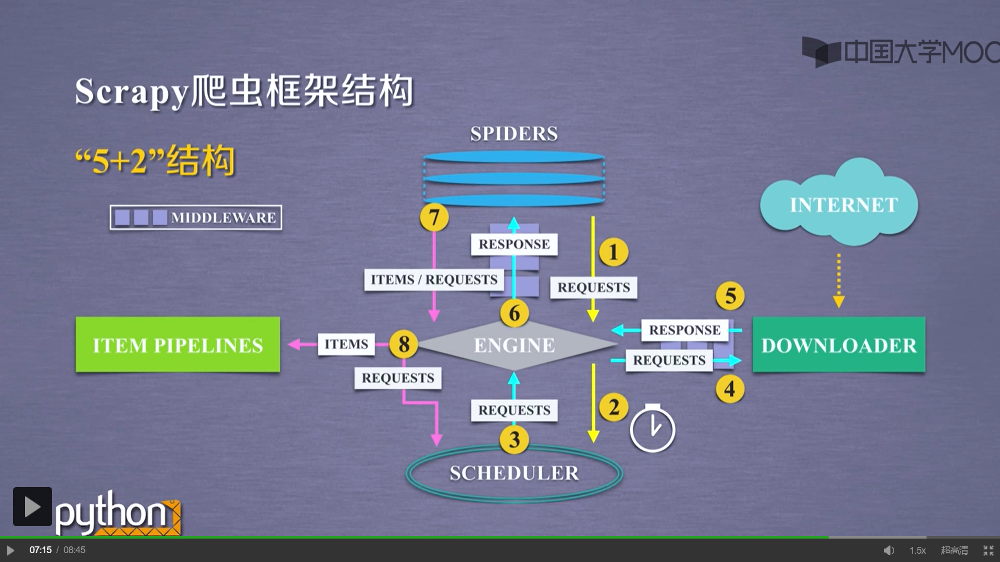
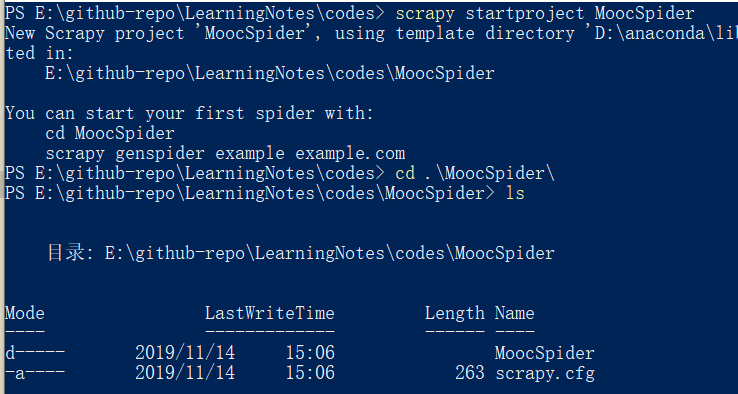

# Scrapy学习报告

#### 1901210380 符豫 


<!-- TOC -->


- [关于Scrapy](#关于scrapy)
- [安装](#安装)
- [开始](#开始)
- [编写爬虫](#编写爬虫)
    - [items配置](#items配置)
    - [splash lua script编写](#splash-lua-script编写)
    - [编写爬虫](#编写爬虫-1)
    - [存储到文件中](#存储到文件中)
- [爬取结果](#爬取结果)
- [参考资料](#参考资料)

<!-- /TOC -->


## 关于Scrapy

- scrapy提供一些关于爬虫的半成品功能。并发性好，支持xpath和CSS选择器，支持命令行操作。但只能处理静态界面，不能爬取js动态渲染的页面，不支持提交表单，不能应对CAPTCHA。
- 为了获得js动态页面，配合使用scrapy-splash库。splash是一个实现了HTTP API的轻量级浏览器，能够模拟js渲染过程。

- 结构：
    - engine， downloader， scheduler， spiders， item pipelines
    - engine和downloader/spiders之间各有一个中间件
    

- engine:
    - 交通枢纽，中转和控制数据流在不同模块之间的调度；
    - 根据条件触发事件
- downloader:
    - 根据接收到的请求下载网页；
- scheduler：
    - 对requests进行调度
- downloader 中间件
    - 以上三个模块都不需要用户修改，可以通过这个中间件来进行一定的配置，修改、丢弃、新增请求或响应。

- spider:
    - 提供爬虫起点url;
    - 解析response, 提取需要的数据，产生新的requests。
- item pipelines:
    - 流水线方式处理spider产生的爬取项；
    - 对数据进行去重、清理、检验等，以及存入数据库。
    - 决定了用户对最终数据格式内容存储等的要求。
- spider 中间件
    - 对requests和爬取项的再处理，对它们进行修改、丢弃、新增请求或爬取项。

- 过程分析：
    1. 图中1-2为第一个步骤，用户通过spider发出请求request，也就是期望访问和爬取的url。请求经过枢纽engine交由scheduler进行调度和分配，由scheduler来决定何时处理这个请求。
    
    2. 图中3-6为第二个步骤，scheduler通过调度将请求依序途径枢纽engine交由downloader，downloader负责下载相应的内容，并将响应结果response途径engine返回给spider。
    3. 途中7-8为第三个步骤，spider接收到返回结果后，对爬取的内容进行解析，将解析出的爬取项item交给item pipelines，将解析出的仍需要进行进一步爬取的url再交由scheduler进行后续请求。

    - spider是程序的入口，item pipelines是程序的出口。
- 需要用户配置的内容：
    - spider 提供url；解析响应结果
    - item pipeline 对提取的信息进行后续处理


## 安装
- 安装scrapy和splash库
    ```
        conda install scrapy
        pip install scrapy-splash
    ```
- 使用docker运行一个splash instance：
    - 安装docker
    - docker中获得splash镜像
        ```
        docker pull scrapinghub/splash
        ```
    - 开启容器
        ```
        docker run -p 8050:8050 scrapinghub/splash
        ```
    - splash使用本地的8050端口。之后在浏览器中进入"localhost:8050"，页面如下。这里的代码是lua脚本代码，用于对splash对页面的渲染过程进行一定的设置，可以模拟在浏览器中操作页面的行为。
        
    

## 开始
- scrapy通过命令行进行创建项目、创建爬虫、运行爬虫等常见操作。下面用一个爬取中国大学mooc网站上计算机课程的简单爬虫demo作为示例来了解整个过程。
    - 项目名称 MoocSpider
    - 爬虫名称 mooc
    - 初始url icourse163.org

- 创建项目
    ```
    scrapy startproject MoocSpider
    ```
    
- 自动生成的项目结构如下：
    - scrapy.cfg: 配置文件，用于将爬虫部署在服务器上。暂时不需要考虑
    - MoocSpider/
        - \_\_init\_\_.py 初始化脚本，无需修改
        - items.py 
        - middlewares.py
        - pipelines.py
        - settings.py 爬虫的配置文件
        - spiders/
            - \_\_init\_\_.py 初始文件，无需修改
- 创建爬虫文件，之后在spiders文件夹下会生成mooc.py文件。
    ```
    scrapy genspider mooc icourse163.org
    ```           
    
- 为了在项目中使用splash，需要在settings.py文件中进行如下配置：
    ```
    SPIDER_MIDDLEWARES = {
        'scrapy_splash.SplashDeduplicateArgsMiddleware': 100,
    }

    DOWNLOADER_MIDDLEWARES = {
        'scrapy_splash.SplashCookiesMiddleware': 723,
        'scrapy_splash.SplashMiddleware': 725,
        'scrapy.downloadermiddlewares.httpcompression.HttpCompressionMiddleware': 810
    }

    SPLASH_URL = 'http://localhost:8050'

    DUPEFILTER_CLASS = 'scrapy_splash.SplashAwareDupeFilter'
    HTTPCACHE_STORAGE = 'scrapy_splash.SplashAwareFSCacheStorage'
    ```
- 启动爬虫指令
    ```
    scrapy crawl mooc
    ```

## 编写爬虫

### items配置
- 在items.py中定义好要获得的item的名称，相当于一种归类，在解析的时候将相应的内容存储到对应的item中。这里要爬取的是mooc网站上的课程基本信息，一共要获得若干条课程信息，每条信息中都包含名称，讲师，学校等，分别存到对应的item中。
    ```
    class MoocspiderItem(scrapy.Item):
        # define the fields for your item here like:
        # 课程名称
        name = scrapy.Field()
        # 课程主讲
        author = scrapy.Field()
        # 报名人数
        num = scrapy.Field()
        # 标签（如国家精品）
        label = scrapy.Field()
        # 学校
        university = scrapy.Field()
        # 学习进度
        process = scrapy.Field()
        pass
    ```
### splash lua script编写
- 就是前面进入localhost:8050界面中的代码，这里要写在爬虫文件中，功能是告诉splash在进行js渲染的时候需要做的工作。
    - 之前总是无法成功加载，文档中给出的方法是关闭私有模式"splash.private_mode_enabled = false"
    - splash.response_body_enabled = true 使splash在内存中保存每个请求的响应内容
    - splash:go 加载页面
    - splash:wait 等待指定时间
    - return splash:html() 返回渲染后的html代码
    ```
    script = """
            function main(splash, args)
                splash.response_body_enabled = true
                splash.private_mode_enabled = false
                assert(splash:go(args.url))
                assert(splash:wait(args.wait))
                
                return splash:html()
            end
            """
    ```
### 编写爬虫
- url是起始url。name要唯一，在启动爬虫的时候需要用到这个name。
- 自动生成的爬虫中隐藏了start_requests方法，这里由于我们要使用splash库的请求方法SplashRequest，所以要将start_requests方法显式的写出来，并调用SplashRequest方法。这里的参数包括：
    - url
    - callback方法
    - endpoint 还没有查到这个参数的功能使什么。它的默认值是"render.html"
    - args 参数列表，第一项是调用splash所执行的lua脚本，也就是上面解释的那一段代码。wait就是等待的时间。如果在模拟操作的时候需要用到其他的参数，也都一并写在这个args字典中。
- 注意yield关键字。
- 解析部分：
    - 有xpath和css两种选择器用来解析html：
        - "//div[@class='_1gBJC']/div" ： 
            - 最前面的双斜杠//表示从全局查找符合规则的路径；
            - 标签div后面通过[]包裹起来约束条件，无论是class名称还是id名称等都用@来引出。
        - "._1Zkj9 span::text"：
            - 符合CSS选择器约定的查找规则。例如用点.来表示class，用#来表示id等。
            - 前面一级进行约束，后面在前面约束后的html代码中进行查找。
            - span::text，标签名＋::＋attr(属性名) 或 方法名。查找属性如a::attr(href)。
        - 规则太丰富太灵活，随时查阅。
    - 将解析到的内容作为value赋值给item的对应key。
        - item['university'] = university
    - 最终仍用yield关键字来进行提交。
    ```
    class MoocSpider(scrapy.Spider):
        name = 'mooc'
        url = 'https://www.icourse163.org/channel/3002.htm'

        # start request
        def start_requests(self):
            yield SplashRequest(self.url, callback=self.parse, endpoint='execute',
                                args={'lua_source': script, 'wait': 5})

        # parse the html content
        def parse(self, response):
            item = MoocspiderItem()

            all_course_module = response.xpath("//div[@class='_1gBJC']/div")
            courses = all_course_module.css("._2mbYw")

            for course in courses:

                university = course.css("._2lZi3::text").extract()
                name = course.css("h3::attr(title)").extract()
                author = course.css("._1Zkj9 span::text").extract()
                num = course.css("._3DcLu::text").extract()
                process = course.css(".hxvPL::text").extract()
                label = course.css("._3flBx span::text").extract()

                item['university'] = university
                item['name'] = name
                item['author'] = author
                item['num'] = num
                item['process'] = process
                item['label'] = label

                yield item
    ```
### 存储到文件中
- 在settings.py配置文件中添加输出文件名称和文件格式。配置编码格式以避免乱码。
    ```
    FEED_URI=u'mooc_courses.csv'
    FEED_FORMAT='CSV'
    FEED_EXPORT_ENCODING = 'gb18030'

    ```
## 爬取结果
- 一些特殊项没有单独处理；
- 没有进行迭代爬取，只是一个初始界面的demo；
- 进入下一页的链接也由js生成，需要利用lua脚本模拟点击事件；


## 参考资料
- [Python网络爬虫与信息提取](https://www.icourse163.org/course/0809BIT021A-1001870001)
- [scrapy-splash的介绍、安装以及实例](https://www.cnblogs.com/jclian91/p/8590617.html)
- [splash中文文档](https://splash-cn-doc.readthedocs.io/zh_CN/latest/index.html)
- [Python爬虫框架scrapy快速入门](https://www.jianshu.com/p/61911e00abd0)
- [Xpath语法格式整理](https://www.cnblogs.com/Loofah/archive/2012/05/10/2494036.html)
- [Xpath选择器](https://blog.csdn.net/s740556472/article/details/81023624)
- [css选择器提取数据](https://www.cnblogs.com/Python-XiaCaiP/p/10246568.html)